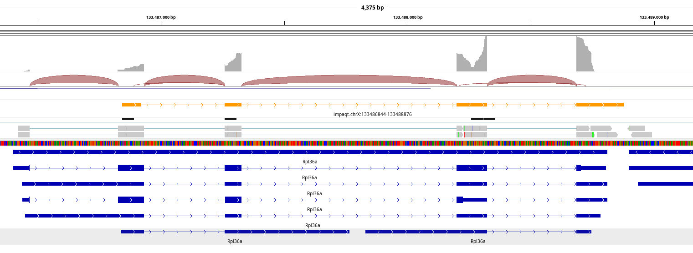

# Impaqt [](https://github.com/bnjenner/impaqt/actions/workflows/c-cpp.yml)
Currently performs transcript identification, gene assignment, and naive quantification. 
A more sophisticated quantification method remain on the TO-DO list.



## Introduction

IMPAQT (Identifies Multiple Peaks and Quantifies Transcripts) is a transcript
identification and gene expression quantification method for TAGseq and
3' mRNAseq experiments. It operates on assumptions about the distribution 
of sequencing reads along the 3' UTR of expressed genes. Clustering these reads 
enables transcript identification and quantification of expression at the gene
and transcript level for isoforms utilizing distinct terminal exons. 

It generates a gene expression counts table based on the assignment of the 
identified transcripts, and optionally, a GTF file defining the boundaries 
of each transcript and their expression level. 

This method is particularly useful in non-model organisms where 3' UTRs for 
most genes are poorly annotated (resulting in massive data loss). Increased
gene density also tends to hurt the assignment of transcripts by this 
aglorithm, as it increases assignment ambiguity. 

## Installation

0. Make sure cmake and make are installed on your machine.

1. Clone this repository and change into it.
```
git clone https://github.com/bnjenner/impaqt.git
cd impaqt
```

2. Create a build directory and change into it.
```
mkdir build
cd build
```

3. Compile
```
cmake ../
make
```

4. Install
```
sudo make install
```

5. Give it a go! 
```
impaqt input.sorted.bam
```

## Usage
```
SYNOPSIS
    impaqt input.sorted.bam [options]

DESCRIPTION
    Identifies Multiple Peaks and Qauntifies Transcripts. Identifies and quantifies isoforms
    utilizing distinct terminal exons. Generates a GTF file of identified read clusters and
    optionally a counts file written to stdout.

REQUIRED ARGUMENTS
    BAM INPUT_FILE

OPTIONS
    -h, --help
          Display the help message.
    -t, --threads INTEGER
          Number of processers for multithreading. Default: 1.
    -a, --annotation INPUT_FILE
          Annotation File (GTF or GFF). Default: .
    -l, --library-type STRING
          Library type. Paired end is not recommended. Only used to check proper pairing. One of
          single and paired. Default: single.
    -s, --strandedness STRING
          Strandedness of library. One of forward and reverse. Default: forward.
    -n, --nonunique-alignments
          Count primary and secondary read alignments.
    -q, --mapq-min INTEGER
          Minimum mapping quality score to consider for counts. Default: 1.
    -w, --window-size INTEGER
          Window size to use to parition genome for read collection. Default: 1000.
    -m, --min-count INTEGER
          Minimum read count to initiate DBSCAN transcript identification algorithm. (Minimum of 10)
          Default: 25.
    -p, --count-percentage INTEGER
          Minimum read count percentage for identifying core reads in DBSCAN algorithm. This will be
          the threshold unless number of reads is less than 10. Default: 5.
    -e, --epsilon INTEGER
          Distance (in base pairs) for DBSCAN algorithm. Default: 150.
    -f, --feature-tag STRING
          Name of feature tag. Default: exon.
    -i, --feature-id STRING
          ID of feature (use for GFFs). Default: gene_id.
    -o, --output-gtf STRING
          Specify name of cluster GTF file. Default is BAM name + ".gtf".
    --version
          Display version information.

VERSION
    Last update: July 2025
    impaqt version: 1.0.0
    SeqAn version: 2.4.0
```

## Dependencies
Utilizes libraries like [bamtools](https://github.com/pezmaster31/bamtools) and [seqan](https://github.com/seqan/seqan) and contains algorithms inspired by [EmbeddedArtistry](https://github.com/embeddedartistry/embedded-resources/blob/master/examples/cpp/dispatch.cpp) and github user [Eleobert](https://github.com/Eleobert/dbscan/blob/master/dbscan.cpp).

## Contact
For questions or comments, please contact
Bradley Jenner at <bnjenner@bu.edu>


