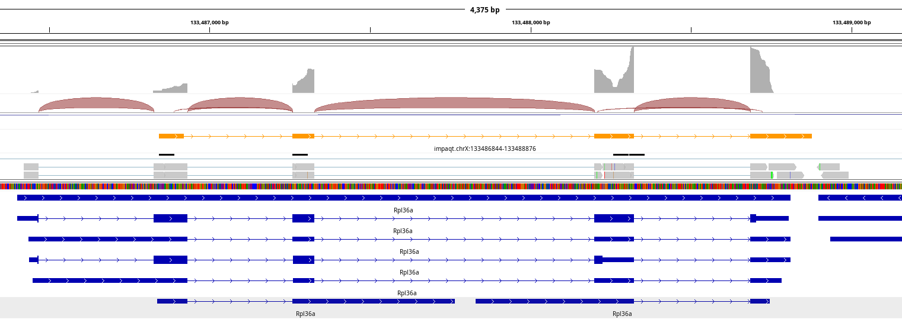

# Impaqt [](https://github.com/bnjenner/impaqt/actions/workflows/c-cpp.yml)
Currently performs transcript identification, gene assignment, and naive quantification. 
A more sophisticated quantification method remain on the TO-DO list.



## Introduction

IMPAQT (Identifies Multiple Peaks and Quantifies Transcripts) is a transcript
identification and gene expression quantification method for TAGseq and
3' mRNAseq experiments. It operates on assumptions about the distribution 
of reads along the 3' UTR of expressed genes. Clustering these reads 
enables pseudo-transcript identification and quantification of expression at the 
gene and transcript level for isoforms utilizing distinct 3' ends. 

It generates a GTF file defining the boundaries of each transcript and their 
expression level as well as, optionally, a gene expression counts table 
if a reference annotation is provided. 

This method is particularly useful in non-model organisms where 3' UTRs for 
most genes are poorly annotated (resulting in massive data loss). Increased
gene density also tends to hurt the assignment of transcripts by this 
aglorithm, as it increases assignment ambiguity. Reads for which a reasonable
transcript of origin cannot be identified are handled individually. 

## Installation

### Conda (recommended)

impaqt is on [bioconda](https://anaconda.org/bioconda/impaqt) with prebuilt
binaries for linux-64, linux-aarch64, osx-64, and osx-arm64 — no compiler or
manual dependency setup required:
```
conda install -c bioconda -c conda-forge impaqt
```
(or, with `mamba`, `mamba install -c bioconda -c conda-forge impaqt`)

Then give it a go!
```
impaqt input.sorted.bam
```

### Build from source

0. Make sure `cmake` (≥ 3.18), `make`, a C++17 compiler, and `zlib` are installed on your machine.

```
# Linux  (build-essential provides g++ and make)
sudo apt install build-essential cmake zlib1g-dev

# Mac  (xcode-select --install provides the compiler, if not already present)
brew install cmake zlib
```

> **Note:** The remaining third-party libraries (bamtools, GoogleTest) are
> downloaded and built automatically by CMake on the first configure, so an
> internet connection is required the first time you build. They are pinned to
> specific versions and are not vendored in this repository.

1. Clone this repository and change into it.
```
git clone https://github.com/bnjenner/impaqt.git
cd impaqt
```

### Quick install (recommended)

Use the provided script, which configures, builds, and (optionally) installs:
```
./install.sh --install            # build + install to the system prefix (uses sudo)
./install.sh                      # build only -> ./build/impaqt
./install.sh --install --prefix ~/.local   # install without sudo
```
Run `./install.sh --help` for all options (build type, parallel jobs, prefix).

### Manual build

```
cmake -S . -B build -DCMAKE_BUILD_TYPE=Release
cmake --build build
sudo cmake --install build         # installs only the impaqt binary
```

Then give it a go!
```
impaqt input.sorted.bam
```

## Usage
```
impaqt -- Identifies Multiple Peaks and Quantifies Transcripts.

Identifies and quantifies isoforms utilizing distinct 3' ends. Generates a GTF
file of identified transcripts and optionally a counts file to stdout if a
reference annotation is provided.

Usage: impaqt input.sorted.bam [options]

Options:
  -t, --threads INT             Number of processers for multithreading. [1]
  -a, --annotation FILE         Annotation file (GTF or GFF). If set, a counts
                                table is written to stdout. Type from extension. []
  -s, --strandedness STR        Strandedness of library: forward or reverse. [forward]
  -n, --nonunique-alignments    Count primary and secondary read alignments.
  -q, --mapq-min INT            Minimum mapping quality score to consider. [1]
  -w, --window-size INT         Window size to partition genome for read collection. [1000]
  -m, --min-count INT           Min read count to initiate DBSCAN. (Hard minimum 10) [25]
  -p, --count-percentage INT    Min read count percentage for core reads in DBSCAN. [5]
  -e, --epsilon INT             Neighbor distance (bp) for DBSCAN. [50]
  -d, --density-threshold DBL   Read density (#reads/#bp) to skip identification. [0]
  -f, --feature-tag STR         Name of feature in GTF for assignment. [exon]
  -u, --utr-tag STR             Name of UTR feature in GTF for assignment. [UTR]
  -i, --feature-id STR          ID of feature to use for assignment. [gene_id]
  -o, --output-gtf STR          Output GTF name. [BAM name + ".gtf"]
  -h, --help                    Print this help message and exit.
      --version                 Print version and exit.
```

## Dependencies
Build requirements: `cmake` (≥ 3.18), a C++17 compiler, `make`, and `zlib`.

The following libraries are fetched and built automatically by CMake (via
`FetchContent`) on the first configure — they are pinned to specific versions and
not vendored in this repository:
- [bamtools](https://github.com/pezmaster31/bamtools) (v2.5.3) — BAM file I/O.
- [GoogleTest](https://github.com/google/googletest) (release-1.12.1) — unit tests only.

The DBSCAN clustering algorithm is inspired by github user [Eleobert](https://github.com/Eleobert/dbscan/blob/master/dbscan.cpp), and the thread dispatch by [EmbeddedArtistry](https://github.com/embeddedartistry/embedded-resources/blob/master/examples/cpp/dispatch.cpp).

## Contact
For questions or comments, please contact
Bradley Jenner at <bnjenner@bu.edu>


